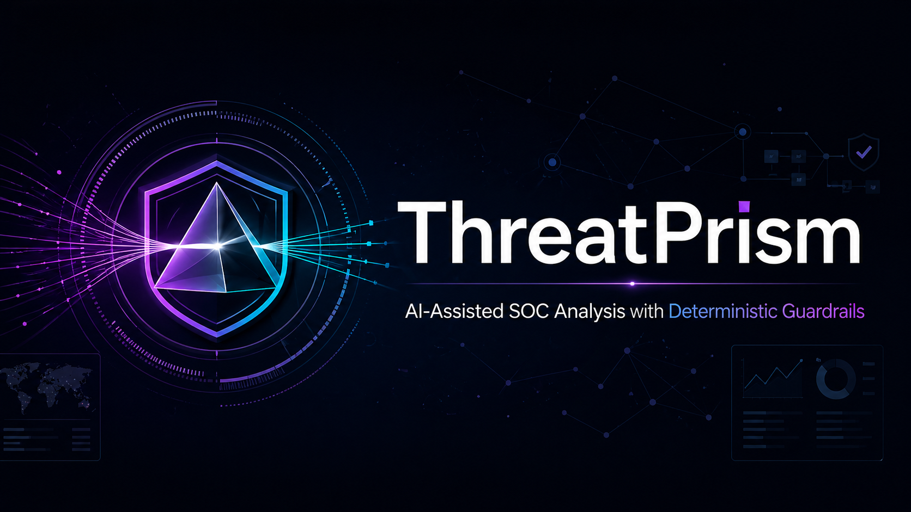
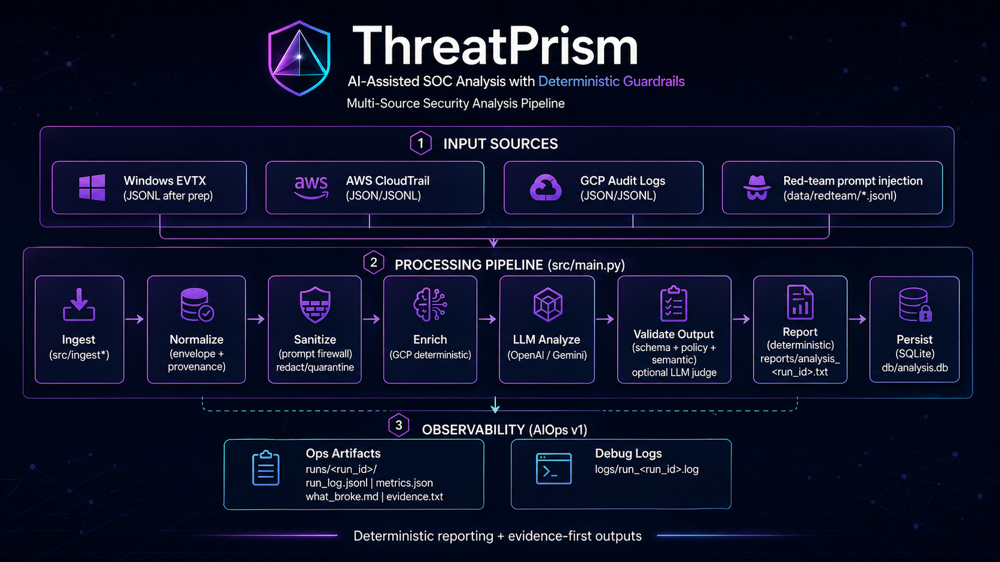

# ThreatPrism

AI-Assisted SOC Analysis with Deterministic Guardrails

<div align="center">
  
</div>

ThreatPrism is an AI-assisted SOC analysis pipeline with deterministic guardrails, evidence-first reporting, and multi-source security log ingestion.

## What It Is

ThreatPrism is a CLI-first SOC analysis system that ingests Windows EVTX-derived JSONL, AWS CloudTrail logs, and GCP Audit Logs. It normalizes events into a common envelope, applies prompt-injection guardrails, uses an LLM only for structured extraction, validates the output, renders deterministic reports, and persists analysis records to SQLite.

ThreatPrism assists SOC analysts; it does not execute response actions.

## Why It Exists

Security analysts often need to triage noisy host and cloud telemetry without losing provenance or over-trusting generated text. ThreatPrism keeps deterministic processing around the model boundary so AI can help summarize and structure evidence while the system preserves traceability, validation, and analyst control.

The tool is designed for analyst augmentation, not autonomous remediation.

## Architecture

ThreatPrism uses a linear pipeline:

```text
Source -> Ingest -> Normalize -> Sanitize -> Enrich -> LLM Analyze -> Validate Output -> Report -> Persist
```

<div align="center">
  
</div>

See [docs/ARCHITECTURE.md](docs/ARCHITECTURE.md) for the full architecture guide.

## Supported Inputs

- Windows event logs pre-parsed from EVTX to JSONL
- AWS CloudTrail JSON or JSONL
- AWS CloudTrail CSV after conversion with `scripts/aws_csv_to_jsonl.py`
- GCP Audit Logs JSON or JSONL
- Prompt-injection lab datasets under `data/redteam/`

ThreatPrism processes one source type per run. Mixed-source correlation is a future enhancement.

## Processing Pipeline

1. Detect the source type from CLI flags, file extensions, and schema markers.
2. Ingest records from the selected source.
3. Normalize records into a common event envelope with `source_file`, `record_index`, and optional `event_id`.
4. Sanitize instruction-like content before model analysis.
5. Enrich cloud logs with deterministic context such as plane tags and identity hints.
6. Send constrained batches to the selected LLM provider unless `--dry-run` is used.
7. Validate model output against schemas, policy rules, and optional semantic checks.
8. Render the report with Python.
9. Persist run metadata, findings, hypotheses, IOCs, and report text to SQLite.

## Guardrails

- LLM inputs and outputs are treated as untrusted.
- LLM output is constrained, validated, and policy-checked before reporting.
- Pydantic schemas define the structured output contract.
- Policy checks block unsafe authority claims and completed-action language.
- Prompt firewall logic redacts or quarantines instruction-like strings before LLM analysis.
- `--dry-run` validates ingestion and guardrail behavior without external LLM calls.

## Evidence-First Reporting

Reports are deterministic and evidence-first. The LLM does not write the narrative report; Python renders structured findings into a repeatable text format.

Every finding must cite provenance:

- `source_file`
- `record_index`
- `event_id` when available, such as GCP `insertId`

## Observability / AIOps Artifacts

Each run writes operational artifacts under `runs/<run_id>/`:

- `run_log.jsonl`
- `metrics.json`
- `what_broke.md` on failure
- `evidence.txt` when generated with the evidence helper

Useful helpers:

```bash
python scripts/evidence_artifact.py --run-id <run_id>
python scripts/failure_drill_1.py
```

See [RUNBOOK.md](RUNBOOK.md) and [docs/THREATPRISM_AIOPS_CODEX_SPEC.md](docs/THREATPRISM_AIOPS_CODEX_SPEC.md).

## Example Workflow

Validate the bundled Windows sample without calling an LLM:

```bash
python -m src.main --input data/evtx_sample --dry-run
```

Convert the bundled AWS sample CSV and validate ingestion:

```bash
python scripts/aws_csv_to_jsonl.py data/sample_cloudtrail.csv data/sample_aws.jsonl
python -m src.main --input data/sample_aws.jsonl --source aws --dry-run
```

Validate the bundled GCP synthetic mini-lab:

```bash
python -m src.main --input data/gcp_synthetic_minilab.jsonl --source gcp --dry-run
```

Run model-backed analysis only after configuring a real provider key:

```bash
python -m src.main --input data/evtx_sample --provider gemini --model gemini-flash-latest
python -m src.main --input data/evtx_sample --provider openai --model gpt-4o
```

## Security Limitations

- ThreatPrism does not determine that activity is definitively malicious.
- ThreatPrism does not isolate hosts, disable accounts, block network traffic, or modify cloud resources.
- LLM extraction can be incomplete or incorrect, so analyst review is required.
- AWS and GCP plane tagging is heuristic and conservative.
- Binary EVTX parsing is out of scope; EVTX must be converted to JSONL first.
- Raw CloudTrail records and sensitive request/response payloads are intentionally not stored in SQLite.
- External LLM calls require valid provider credentials and should not be used for local validation unless explicitly intended.

## Run Locally

Clone the future public repository URL:

```bash
git clone https://github.com/mwill20/threatprism.git
cd threatprism
```

Create and activate a virtual environment:

```bash
python -m venv .venv
```

PowerShell:

```powershell
.\.venv\Scripts\Activate.ps1
```

bash:

```bash
source .venv/bin/activate
```

Install dependencies:

```bash
pip install -r requirements.txt
```

Optional provider setup for non-dry-run analysis:

```bash
cp .env.example .env
```

Then add `GEMINI_API_KEY` or `OPENAI_API_KEY` to `.env`.

Safe local validation commands:

```bash
python -m src.main --input data/evtx_sample --dry-run
python -m pytest
python -m compileall .
```

## Project Status

ThreatPrism is a local CLI project for AI-assisted SOC analysis experiments and demonstrations. Current functionality includes Windows, AWS, and GCP ingestion paths; deterministic reporting; SQLite persistence; prompt-injection guardrails; and run-level observability artifacts.

Planned improvements include a richer analyst UI, multi-source correlation, stronger offline evaluation workflows, and broader detection coverage.

## License and Attribution

- License: MIT, see [LICENSE](LICENSE)
- EVTX dataset: <https://github.com/sbousseaden/EVTX-ATTACK-SAMPLES>
- AWS dataset: <https://www.kaggle.com/datasets/nobukim/aws-cloudtrails-dataset-from-flaws-cloud>
