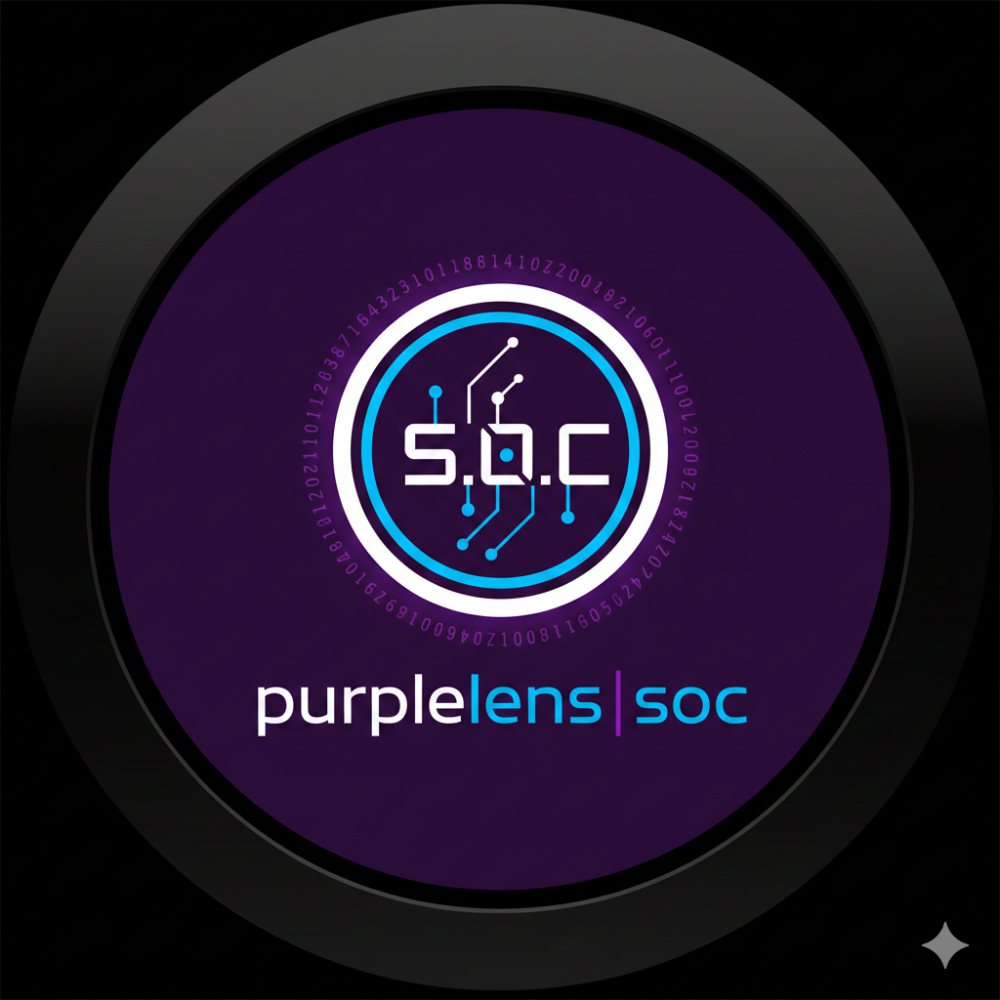
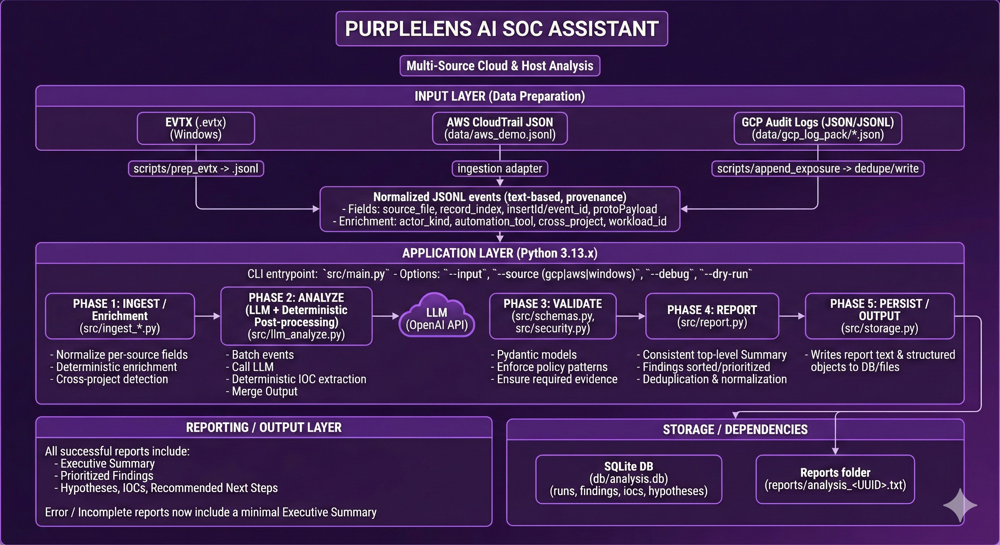

<div align="center">
  
</div>

# PurpleLens AI SOC Assistant

## Overview
- CLI-driven SOC assistant that ingests parsed Windows EVTX telemetry (JSONL).
- Uses an LLM strictly as a structured extraction engine; **deterministic Python renders the SOC report and persists run metadata**.
- Guardrails enforce evidence-backed findings, policy-compliant narratives, and SQLite persistence for auditability.

### 🌍 The Big Picture: What Problem Are We Solving?
In plain English:
You're a SOC analyst drowning in event logs. You need to find suspicious activity, but:

- Reading raw .evtx files is painful (binary format)
- You have hundreds or thousands of events
- You need to explain what you found 
- You want to remember what you analyzed before

### What PurpleLens does:
It's like having a smart assistant that:

1. Converts messy binary logs into readable text
2. Reads through all the events looking for patterns
3. Writes a professional security report
4. Saves everything in a database so you can search later

## Installation
1. Clone the repo and enter it.
   ```bash
   git clone https://github.com/mwill20/purplelens-soc.git
   cd purplelens-soc
   ```
2. Install dependencies.
   ```bash
   pip install -r requirements.txt
   ```
3. Configure your OpenAI API key.
   ```bash
   # Copy the example file
   copy .env.example .env
   
   # Edit .env and add your API key:
   # OPENAI_API_KEY=sk-proj-...
   ```
   
   **Note:** The `.env` file is gitignored and will not be committed to version control.

### Dataset Preparation (PowerShell)
1. Clone EVTX-ATTACK-SAMPLES.
   ```powershell
   git clone https://github.com/sbousseaden/EVTX-ATTACK-SAMPLES.git
   ```
2. Copy 2–4 relevant `*.evtx` files into `data\evtx_raw\` (e.g., Execution, Credential Access, Lateral Movement).
3. Convert to JSONL.
   ```powershell
   .\scripts\prep_evtx.ps1 -InputPath ".\data\evtx_raw" -OutputPath ".\data\evtx_parsed"
   ```
4. Verify JSONL contents using any text viewer.

### Usage Examples

**Model Selection and JSON Output Compatibility**

PurpleLens relies on OpenAI models that support structured JSON output using the `response_format={"type": "json_object"}` parameter. For best results, use models like `gpt-4o`, `gpt-4-1106-preview`, or `gpt-3.5-turbo-1106`. Older models (e.g., `gpt-4`, `gpt-3.5-turbo`) do not support this parameter and will return an error. Always specify a compatible model using the `--model` argument:

```bash
python -m src.main --input data/evtx_parsed/ --model gpt-4o --output file
```

If you use an unsupported model, the tool will not generate a report and will return an API error. See OpenAI documentation for the latest list of supported models.
```bash
# Minimal run
python -m src.main --input data/evtx_parsed/

# Verbose logging
python -m src.main --input data/evtx_parsed/ --verbose

# Dry run (validation only)
python -m src.main --input data/evtx_parsed/ --dry-run

# Custom model and output to file
python -m src.main --input data/evtx_parsed/ --model gpt-4o --output file
```

## Data Sources
PurpleLens supports multiple log formats:
- **Windows EVTX** - Fully implemented and tested
- **AWS CloudTrail** - Adapter scaffolded (Phase 1 implementation pending)

### Source Detection
PurpleLens automatically detects log format based on:
1. File extension (`.evtx`, `.json`, `.jsonl`)
2. Content analysis (CloudTrail schema markers)
3. Directory contents (mixed directories require `--source` flag)

Use `--source aws|windows` to override auto-detection when needed.

### Known Limitations
- CLI only; GUI is a future enhancement.
- Requires pre-parsed JSONL EVTX files; raw EVTX parsing is out of scope.
- Windows telemetry focus and single-dataset demo (EVTX-ATTACK-SAMPLES subsets).
- Single OpenAI model call per run; no multi-turn reasoning.
- LLM outputs can still contain redundant summaries or overlapping recommendations; report post-processing mitigates but does not fully eliminate this.
- **This tool does not make determinations or take actions** - it provides structured evidence for analyst review.
- **Guardrail Coverage:** LLM guardrails generally consist of three types:
  - **Structural/Deterministic:** Validates data structure, types, and constraints using Pydantic schemas (✅ Implemented via `schemas.py`)
  - **Pattern-Based Policy:** Enforces content policies through regex pattern matching for prohibited language (✅ Implemented via `security.py` - blocks false authority claims like "I have blocked..." or "This is malicious")
  - **Semantic/Reasoning:** Validates logical coherence, contextual accuracy, and reasoning quality of LLM outputs (⚠️ Intentionally simplified for demo - production deployments should add semantic validation as defense-in-depth via LLM-as-validator, rule-based security logic, or confidence calibration)

### Future Enhancements
1. Streamlit/GUI wrapper for analysts.
2. Multi-source log ingestion (Sysmon, firewall, cloud identity).
3. Streaming/real-time ingestion.
4. Provider-agnostic LLM abstraction and offline reasoning modes.
5. MITRE ATT&CK tagging within schemas and reports.
6. Select an AI Model tuned for analysis of security events or fine-tune a model.
7. **Semantic Guardrails:** Implement LLM-as-validator pattern (secondary model validates reasoning), rule-based security logic checker (validates findings align with known attack patterns), or confidence score calibration (validates confidence matches evidence strength).
8. **Event Caching:** Hash-based deduplication to avoid re-analyzing identical events across runs, reducing API costs and latency for repeated analysis workflows.
9. **Advanced Security Scanning:** Extend guardrails to detect PII/PHI leakage (SSNs, credit cards, health data in analyst notes), prompt injection attacks (direct: malicious prompts in event data; indirect: poisoned logs attempting LLM manipulation), and model safety violations (attempts to jailbreak model constraints or elicit harmful outputs). Note: As an internal SOC tool with controlled inputs (parsed telemetry), priority is lower than public-facing systems, but relevant for defense-in-depth against compromised log sources or insider threats.
10. **Production Database:** Replace SQLite with MySQL or PostgreSQL for multi-user environments, concurrent access, and enterprise-scale deployments requiring RBAC, replication, and performance optimization.
11. **Report De-duplication:** Improve semantic merging of findings and recommendations (e.g., similarity scoring or LLM-assisted clustering) to reduce overlap without losing detail.
12. **IOC Enrichment:** Add normalization and context for IOCs (e.g., SID resolution or hash metadata) to improve interpretability in reports.
13. **Analyst Determinations:** Add a post-run analyst decision record (analyst name, determination, notes, IR/customer notification flags, timestamp) linked to `run_id` for auditability and SLA tracking.

### Architecture

<div align="center">
   
</div>

**Quick Overview:** Input JSONL is ingested with provenance (`source_file`, `record_index`). The tool batches events into a schema-defined LLM prompt, requesting structured JSON only. Pydantic validates structural schema compliance first, then regex guardrails check language policy (preventing false authority claims). Python renders a deterministic SOC report and persists run metadata to SQLite (`analysis_runs`, `findings`, `hypotheses`, `indicators_of_compromise`, `reports`). CLI remains the primary interface for predictable demos.

**Detailed Documentation:** See [docs/ARCHITECTURE.md](docs/ARCHITECTURE.md) for:
- Complete system architecture diagrams
- End-to-end data flow trace
- File responsibility matrix
- Error handling paths
- Architecture decision rationale

### Testing
```bash
python tests/test_phase1a.py
python tests/test_phase1b.py
python tests/test_phase1c.py
python tests/test_phase1d.py
python tests/test_full_flow.py  # mocked LLM, end-to-end
```

### Project Structure
```
src/
    __init__.py
    main.py
    ingest.py
    llm_analyze.py
    report.py
    storage.py
    schemas.py
    security.py
tests/
    __init__.py
    test_phase1a.py
    test_phase1b.py
    test_phase1c.py
    test_phase1d.py
    test_full_flow.py
scripts/prep_evtx.ps1
data/evtx_raw/        # selected EVTX files (from EVTX-ATTACK-SAMPLES)
data/evtx_parsed/     # JSONL output consumed by CLI
db/analysis.db        # created automatically
validation/           # overseer approvals
```

### License & Attribution

**License:** [MIT License](LICENSE) - Free to use for educational, portfolio, and commercial purposes.

**Third-Party Attributions:**
- **EVTX Dataset:** [sbousseaden/EVTX-ATTACK-SAMPLES](https://github.com/sbousseaden/EVTX-ATTACK-SAMPLES) - Sample Windows event logs for testing
- **OpenAI API:** Requires valid API key and compliance with [OpenAI Terms of Service](https://openai.com/policies/terms-of-use)

**Purpose:** This project is designed for cybersecurity portfolio demonstration and technical interviews.
